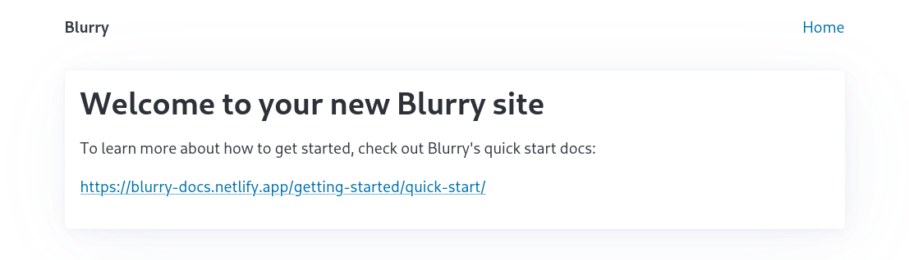

+++
"@type" = "WebPage"
name = "Getting started: quick start"
abstract = "Documentation for how to get started with Blurry"
datePublished = 2023-04-09
dateModified = 2025-01-03
+++

# Getting started: quick start

## Requirements

- [Python](https://www.python.org/) >= 3.11
- [ImageMagick](https://imagemagick.org/index.php) >= [7.1.0-20](https://github.com/ImageMagick/Website/blob/main/ChangeLog.md#710-20---2022-01-22)
- [FFmpeg](https://ffmpeg.org/)

## Installation

Use your preferred Python package manager to install `blurry-cli`:

```bash
# Poetry
poetry add blurry-cli

# uv
uv add blurry-cli

# Pipenv
pipenv install blurry-cli

# pip
pip install blurry-cli
```

## Initialization

To initialize a new Blurry project, run [Blurry's `init` command](../commands/init.md):

```bash
blurry init
```

You'll be prompted for the name and domain of your website.
Than, Blurry will create your `blurry.toml` file, plus a Markdown file for your homepage at `content/index.md` and template files in `templates/`.

Start the [Blurry dev server](../commands/runserver.md) with:

```bash
blurry runserver
```

Navigate to <http://127.0.0.0:8000/> and you'll see your new website in your browser:



## Further reading

### Directory structure

A Blurry project uses a simple directory structure consisting of a `content` directory for [Markdown](https://daringfireball.net/projects/markdown/) site content and a `templates` directory for [Jinja](https://jinja.palletsprojects.com/en/) templates used to generate HTML pages from that Markdown content.
Blurry outputs a built site into `dist/` by default, and this is configurable in [Blurry's settings](../configuration/settings.md).

Blurry's directory structure is used as the website's navigation structure, with just a little magic:

- `index.md` files generate `index.html` files
- other Markdown files, like `about.md`, generate a file like `about/index.html`, which makes for clean, SEO-friendly URLs
- files that end with `.jinja` are processed with [Jinja](https://jinja.palletsprojects.com/en/stable/) and generate a file with the `.jinja` extension removed, like `feed.xml.jinja` -> `feed.xml`. See [Content: dynamic](../content/dynamic.md)
- images are copied and generated at multiple sizes. See [Content: Images](../content/images.md) for more information
- other files are copied as-is

For example, this Blurry project:

```text
.
├──🗀 content
│  ├──🗎 index.md
│  ├──🗎 about.md
│  └──🗀 posts
│     ├──🗎 index.md
│     ├──🗎 feed.xml.jinja
│     └──🗎 welcome.md
├──🗎 robots.txt
└──🗀 templates
   ├──🗎 base.html
   ├──🗎 AboutPage.html
   ├──🗎 Blog.html
   ├──🗎 BlogPosting.html
   └──🗎 HomePage.html
```

Will result in the following URLs:

- `/`
- `/robots.txt`
- `/about/`
- `/posts/`
- `/posts/feed.xml`
- `/posts/welcome/`

### Content

Blurry content files are [Markdown files with front matter](../content/markdown.md), which is a common pattern in other static site generators like [Hugo](https://gohugo.io/content-management/front-matter/) and [Jekyll](https://jekyllrb.com/docs/front-matter/).
Blurry's front matter is written in [TOML](https://toml.io/en/).
The front matter should conform to a [Schema.org](https://schema.org/) Type, and the front matter is passed into the template as [template context](../templates/context.md) for the Jinja template named after the schema type.
The Markdown content is converted to HTML and is added to the Jinja template context as `body`.

Let's look at the homepage for [Table to Markdown](https://tabletomarkdown.com/), a site built with Blurry:

```markdown
+++
"@type" = "WebApplication"
name = "Home"
abstract = "Table to Markdown is a simple Markdown table generator that converts tables from spreadsheet applications and websites into well-formatted Markdown tables."
+++

# Easy Markdown Tables with Table to Markdown

<div class="custom-element-container">
  <table-converter></table-converter>
</div>

## A beginner's guide to Markdown

In the [original Markdown spec](https://daringfireball.net/projects/markdown/), John Gruber describes Markdown as "a text-to-HTML conversion tool for web writers."

[...]
```

:::{info}
The Table to Markdown homepage includes a small amount of HTML in its Markdown content, including the `<table-converter>` [Web Component](https://developer.mozilla.org/en-US/docs/Web/Web_Components).

Web Components are [a great way to sprinkle interactivity into a static site](https://johnfraney.ca/blog/vue-static-site-web-component-custom-elements/).
:::

### Templates

The corresponding `WebApplication.html` [template file](../templates/syntax.md) might look like this:

```html
<!DOCTYPE html>
<html lang="en">
<head>
    <meta charset="utf-8">
    <meta name="description" content="{{ abstract }}">
    <title>{{ name }}</title>
    {{ schema_type_tag|safe }}
    {{ open_graph_tags|safe }}
</head>

<body>
  {{ body|safe }}

  <p>Published by: {{ author.givenName }} {{ author.familyName }}</p>
</body>
</html>
```

See the [Templates: syntax](../templates/syntax.md) and [Templates: context](../templates/context.md) docs for more information, and [Templates: examples](../templates/examples.md) for simple and more advanced templates.

### Commands

Blurry can build a static site to prepare for deployment, or it can be run as a server with live reload.

To build for production ([docs](../commands/build.md)), run:

```bash
blurry build
```

To start the development server ([docs](../commands/runserver.md)), run:

```bash
blurry runserver
```

Then visit <http://127.0.0.1:8000> in your browser to see your site.
The site is rebuilt when files in the `templates` and `content` directories are modified.
